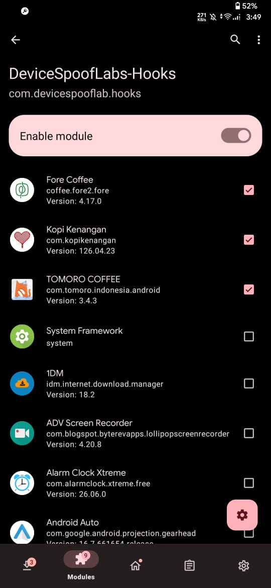
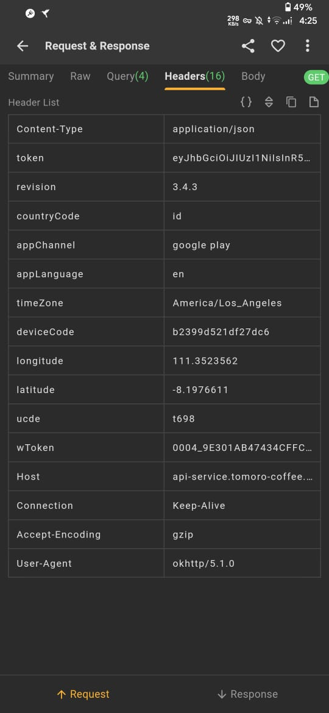
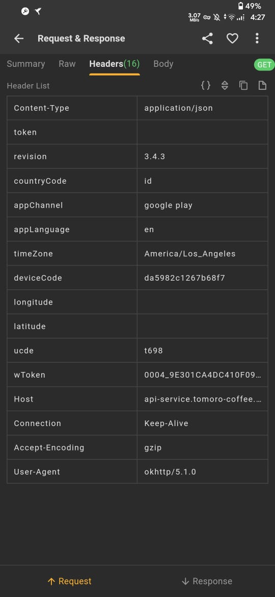

# ANDROID DEVICE IDENTITY

[back](./README.md)

## Bahan
- android dengan akses root (pake magisk gw)
- [lsposed](https://github.com/JingMatrix/Vector) ( pake versi zygisk )
- [DeviceSpoofLabs-hooks](https://github.com/yubunus/DeviceSpoofLab-Hooks)

## Steps
- aktifkan module [lsposed](https://github.com/JingMatrix/Vector) di magisk kemudian restart

- aktifkan module [DeviceSpoofLabs-hooks](https://github.com/yubunus/DeviceSpoofLab-Hooks) dan beri checklist ke aplikasi yang mau di hooks kemudian restart

    

- setiap mau generate device identity baru, hapus data aplikasi [DeviceSpoofLabs-hooks](https://github.com/yubunus/DeviceSpoofLab-Hooks) dan aplikasi yang mau di hooks,kemudian buka aplikasi [DeviceSpoofLabs-hooks](https://github.com/yubunus/DeviceSpoofLab-Hooks) agar dia generate device baru, tak perlu restart untuk menerapkan perubahan

    
    
    

- jadi inti dari steps ini adalah, hapus data aplikasi dan [DeviceSpoofLabs-hooks](https://github.com/yubunus/DeviceSpoofLab-Hooks), kemudian buka [DeviceSpoofLabs-hooks](https://github.com/yubunus/DeviceSpoofLab-Hooks) (untuk generate device id), baru buka aplikasi lagi