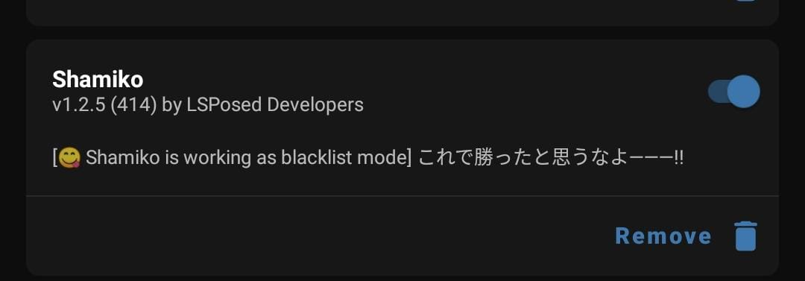
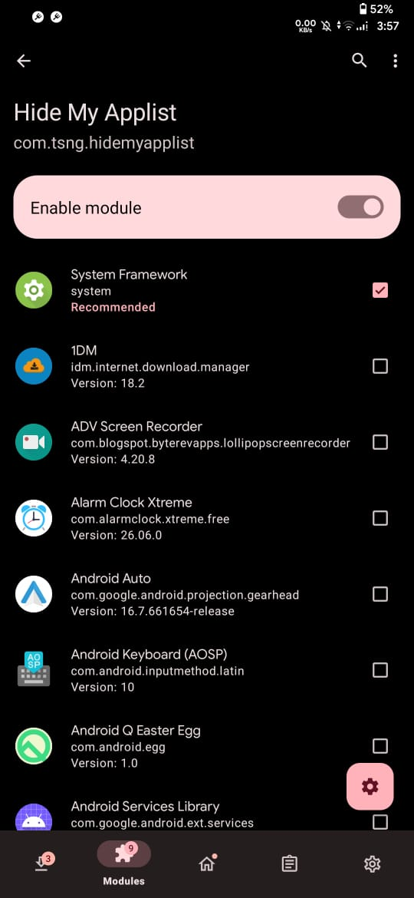
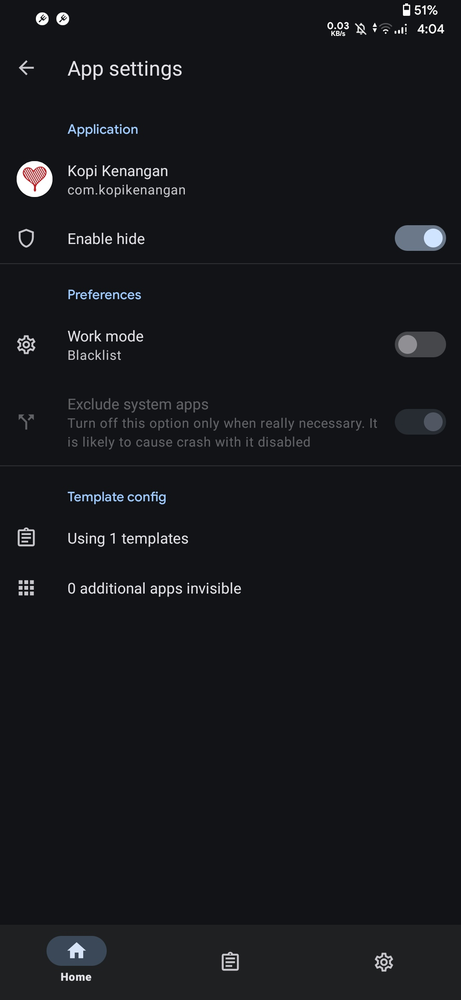

# Hide Root

[← Back](./README.md)

---

## Bahan

- [LSPosed](https://github.com/JingMatrix/Vector) *(gunakan versi Zygisk)*
- [HMA (Hide My Applist)](https://github.com/dr-tsng/hide-my-applist)
- [PlayIntegrityFork](https://github.com/osm0sis/PlayIntegrityFork) *(opsional)*

---

## Steps

### 1. Install Magisk dan Shamiko

Saya menggunakan:

- [Magisk](https://github.com/topjohnwu/magisk)
- [Shamiko](https://github.com/LSPosed/LSPosed.github.io)

#### Screenshot

---

### 2. Install LSPosed

Install module [LSPosed](https://github.com/JingMatrix/Vector) melalui Magisk, lalu restart device.

> Skip langkah ini jika LSPosed sudah terinstall.

---

### 3. Install HMA di LSPosed

Install module [HMA](https://github.com/dr-tsng/hide-my-applist) melalui LSPosed, lalu beri checklist seperti berikut:

---

### 4. Buat Blacklist Template di HMA

Buka aplikasi HMA, lalu:

- Buat blacklist template
- Pilih aplikasi yang ingin di-hide

Contoh yang saya hide:

- Magisk
- Beberapa module LSPosed

---

### 5. Terapkan Template ke Aplikasi Target

Untuk mengaktifkan hide root, terapkan template HMA tadi ke aplikasi target.

---

### 6. Lakukan Detection Test

Gunakan aplikasi detection test terlebih dahulu untuk memastikan hide root berhasil.

---

## Notes

- Tidak semua aplikasi dapat menggunakan metode ini.
- Beberapa aplikasi memiliki proteksi root detection yang lebih ketat.